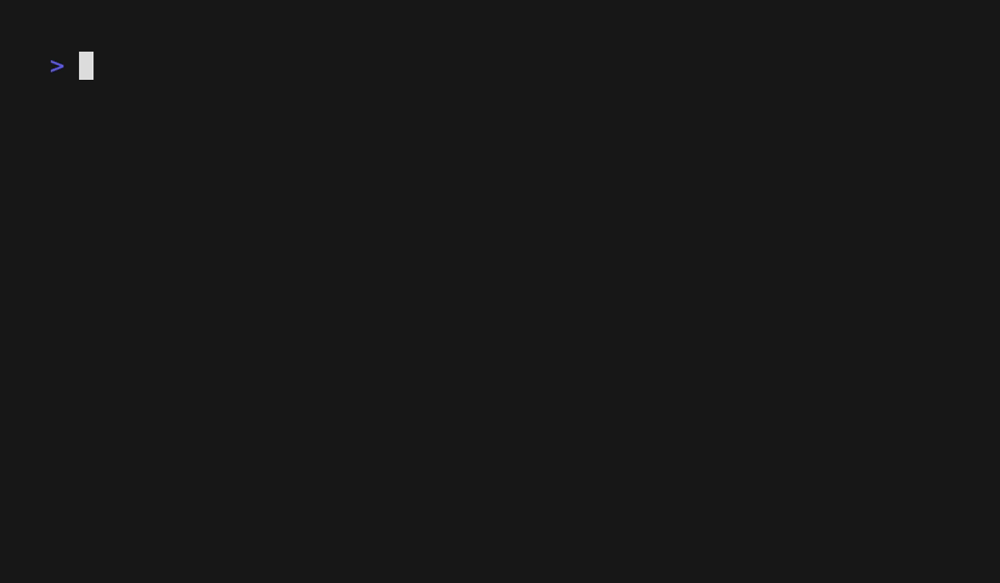

# Forge

Lightweight CLI competitive programming tool: run tests, stress-test with a generator, set up project dirs, and manage input/output files without the need to handle tons of bash aliases.


## GIF Demo


## Dev Notes

Built on/for mac - issues might arrises where I might've hardcoded commands in std::system calls - lmk if any windows user has a moment to run the compatability issues through cursor/claude and find where the issues lie.

Designed to be easily extensible so if I/the user wants to add a new command or feature they can just go to cli.cpp add the new argument that triggers the feature and then develop it as a file in src.

Happy to raise any issues regarding this. Did it as my first c&#43;&#43; project to learn the language and also to understand using the std::filesystem in c&#43;&#43;17

Used as little AI as I could and where used it has been referenced (if you see something unreferenced lmk) - while more ineffiecent I did it so I could properly learn the language cmake. AI was used however for the readme and all the make files for user installation

At the time didn't know aliasing was a thing in ~/.zshrc but still I use the tool a lot in my day to day even for extraneous solutions

Note: issues with forge review - process management identifier causing crashes on terminal like when the code calls system it actaully spawns another terminal process which when switching back and forth can cause terminal to crash. Tried implimenting My own native text reader, however it wasn't as smart as the 'cat' Command which Saved at the end of every newline - and it also had bugginess so didn't pursue.


## Requirements

- **CMake** 3.20 or newer  
- **C++17** compiler (e.g. GCC 8+, Clang 6+, MSVC 2017+)  
- No external libraries; uses the C++ standard library only. (requires the correct c standard otherwise will not run)

## Build

From the project root:

```bash
mkdir -p build && cd build
cmake ..
cmake --build .
```

The `forge` executable is produced in `build/bin/forge` (or `build/bin/Debug/forge` / `build/bin/Release/forge` with multi-config generators).

### Quick build (Makefile wrapper)

```bash
make build
# or: make && ./build/bin/forge help
```

### Test that it works

From the project root after building:

```bash
./build/bin/forge help
./build/bin/forge flags
```

From a directory that has `sol.cpp` and `.in`/`.out` test files (e.g. `sandbox/`), run `forge test`. To try setup without installing: `./build/bin/forge setup /tmp/forge-test-dir` (then remove the dir if you like).

## Install (optional)

Copy the binary to a directory on your `PATH`, or symlink so rebuilding updates the command:

```bash
cp build/bin/forge /usr/local/bin/
# or: sudo cp build/bin/forge /usr/local/bin/

# Symlink instead (no need to re-copy after rebuilds):
ln -s "$(pwd)/build/bin/forge" /usr/local/bin/forge
# or: sudo ln -s "$(pwd)/build/bin/forge" /usr/local/bin/forge
```

## Editor (for `forge setup`)

When you run `forge setup <dir>`, Forge opens the new solution file in an editor. Set the editor command in `include/Constants.h` (e.g. `subl` for Sublime, `code` for VS Code).

## Usage

- `forge help` — show commands and usage  
- `forge test [test_dir]` — run local `.in`/`.out` test cases  
- `forge stress [count]` — run generator stress tester (gen/brute/sol)  
- `forge setup <dir>` — create a new project directory with `sol.cpp` and open it in your editor  
- `forge in [tag]` — create or manage sample input/output files; `-m` explicit command mode, `-p` print all existing tests  
- `forge review` — append to `REVIEW.MD` in the current directory; `-v` view its contents  
- `forge flags` — detailed flag documentation  

## Project layout

| Path | Purpose |
|------|--------|
| `src/` | Application source (CLI, planner, executor, utils) |
| `include/` | Headers and `Constants.h` |
| `sandbox/` | Example/sandbox files (not part of the build) |
| `toys/` | Small experiments and dev utilities (not part of the build) |
| `src/extra code features/` | Optional snippets and generators (not part of the main build) |
| `build/` | CMake build directory (create with `mkdir build && cd build && cmake ..`) |

The main build only compiles sources listed in `CMakeLists.txt`; `sandbox/`, `toys/`, and `src/extra code features/` are for local use and are not compiled by default.
